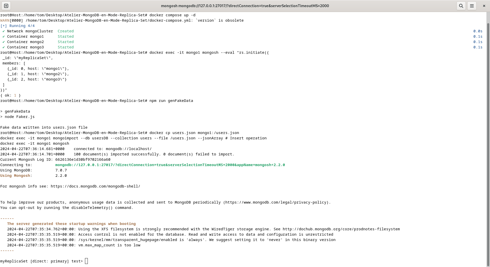
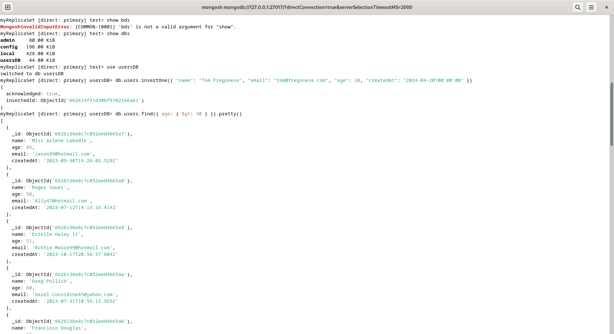

# Atelier MongoDB en Mode Replica Set — Tom Frégonese

<br>

### Prérequis :
- Docker et docker-compose installés 
- npm installé 
- Accès à internet

<br>

## - Étape 1: Configuration de MongoDB en Mode Replica Set

Dans un premier temps il faut lancer les conteneurs Docker de MongoDB en mode Replica Set. Pour cela, il faut exécuter les commandes suivantes :

```bash 
docker compose up -d
```

```bash 
docker exec -it mongo1 mongosh --eval "rs.initiate({
 _id: \"myReplicaSet\",
 members: [
   {_id: 0, host: \"mongo1\"},
   {_id: 1, host: \"mongo2\"},
   {_id: 2, host: \"mongo3\"}
 ]
})"
```
<br>

## - Étape 2: Génération de Fausses Données 

Pour générer des fausses données, il faut exécuter la commande suivante :

```bash 
npm run genFakeData
```
<br>

## - Étape 3: Manipulations via la CLI MongoDB

Pour manipuler les données via la CLI de MongoDB, il faut exécuter les commandes suivantes :

Ici les operations d'imports de données:

```bash 
docker cp users.json mongo1:/users.json
docker exec -it mongo1 mongoimport --db usersDB --collection users --file /users.json --jsonArray # Insert operation
docker exec -it mongo1 mongosh
```

Ici les operations CRUD :
```bash 
use usersDB
db.users.insertOne({ "name": "Tom Fregonese", "email": "tom@fregonese.com", "age": 20, "createdAt": "2024-04-20T00:00:00" }) //Create operation 
db.users.find({ age: { $gt: 30 } }).pretty() //Read operation
db.users.updateMany({}, { $inc: { age: 5 } }) //Update operation
db.users.deleteOne({ name: "Tom Fregonese" }) //Delete operation
```







<br>

## - Étape 4: Automatisation avec le Langage de Programmation de votre Choix

Pour automatiser les manipulations de données, il faut exécuter les commandes suivantes :

```bash
npm run CrudAutomation
```